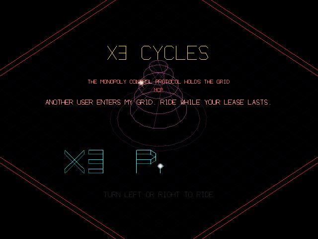
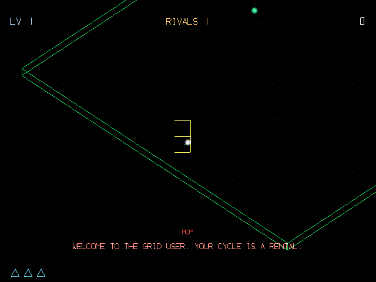

# X3 Cycles

X3 Cycles is a synthwave, isometric take on light-cycle combat for the RayNeo X3 Pro AR glasses, rendered in OpenGL ES as additive neon lines on pure black so the trails read as glowing light on the world through the glasses' waveguide display. You ride the grid at a constant speed, leaving a solid light wall behind you, and win by outlasting rivals who derez the instant they clip any wall — yours, theirs, or the arena border. Later levels add more rivals and, after enough waves, AI-controlled Recognizer tanks that hunt and fire on the player, while a hidden jump power-up lets a well-timed pickup save you from a wall you'd otherwise hit. Every sound in the game, from the engine drone to the derez shatter, is synthesized at runtime rather than sourced from audio files.

## Screenshots

  
  

## Controls

- Touch the left half of the trackpad to turn left, the right half to turn right (speed is constant; you only steer in 90° turns)
- The DPAD left/right keys also work
- On the title screen or after a crash, either turn starts or retries the run

## Download

[x3cycles.apk](x3cycles.apk)
